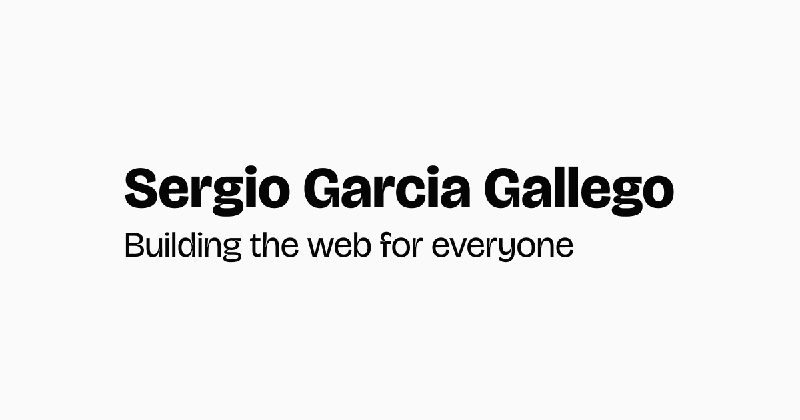

  
  
  
  
   

## Blog posts

<!-- BLOG-POST-LIST:START -->
<!-- BLOG-POST-LIST:END -->

[View more posts](https://sergiogarciagallego.com/blog)

## Recent reads

- [Password protecting routes in Next.js app router](https://www.semplice.com/how-to-write-case-studies-for-your-portfolio)
- [The End of Front-End Development](https://www.joshwcomeau.com/blog/the-end-of-frontend-development/)
- [Help us invent CSS Grid Level 3, aka "Masonry" layout](https://webkit.org/blog/15269/help-us-invent-masonry-layouts-for-css-grid-level-3/)
- [An alternative proposal for CSS masonry](https://developer.chrome.com/blog/masonry)

[View more recent reads](https://sergiogarciagallego.com/reads)

## GitHub Stats

